# 🚀 Etapa 1: Preparación del Ambiente de Laboratorio

[🏠 Inicio](./main.md) | [➡️ Siguiente: Etapa 2](./2-metricas-iniciales.md)

---

<!-- Timer Component -->
<link rel="stylesheet" href="./assets/css/timer.css">

---

## 📦 Obtención de Código Fuente

> **Paso 1:**   Acceso a backstage

1. Accede a la siguiente url: https://backstage.eci-idp.click/
2. Selecciona la opción `Sign In` y posteriormente `Register`
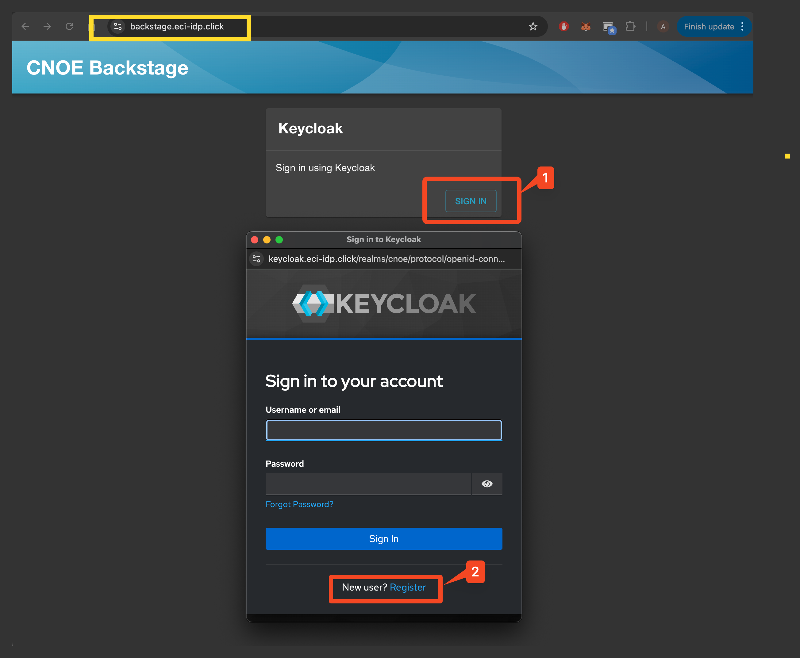
3. Registrate usando usuario, contraseña y correo, utiliza tu usuario de enlace para identificarte, ejemplo `juan.perez-p`. 

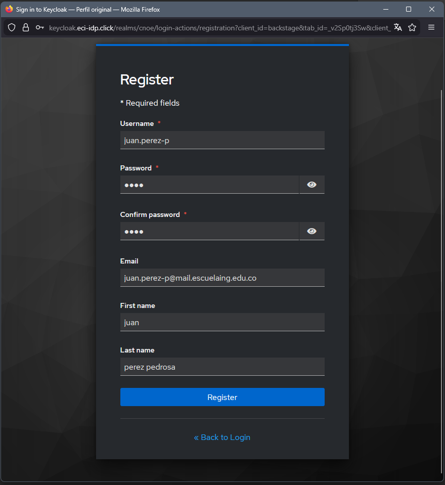

---

## ☁️ Creación de aplicación base
1. Una vez esté registrado en backstage y haya iniciado sesión, Acceda a la sección create
2. Desde la sección create, en la tarjeta con nombre `Java Spring boot app with prometheus and loki integration` seleccione la opción choose
3. Siga los pasos del formulario, para el nombre de la aplicación utilice como prefijo su nombre de enlace reemplazando los caracteres de `.` por `-`. Por ejemplo `juan-perez-p-application`.

Tu profesor te va a proporcionar un nombre de stack, usalo en el paso 2 del formulario.

No olvides añadir tu usuario de Github a la lista de colaboradores!

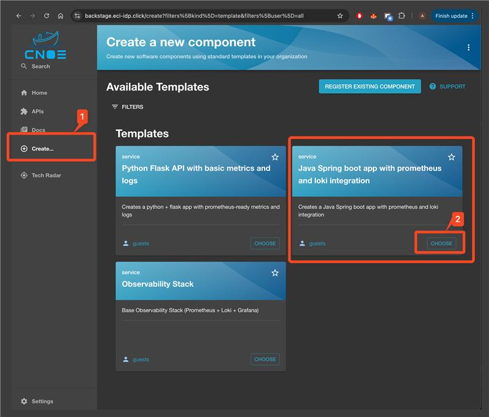

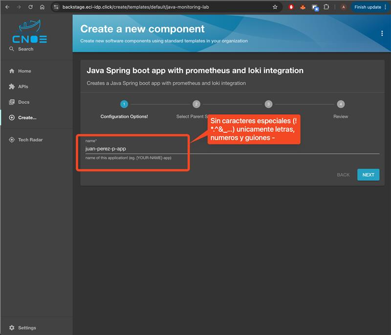

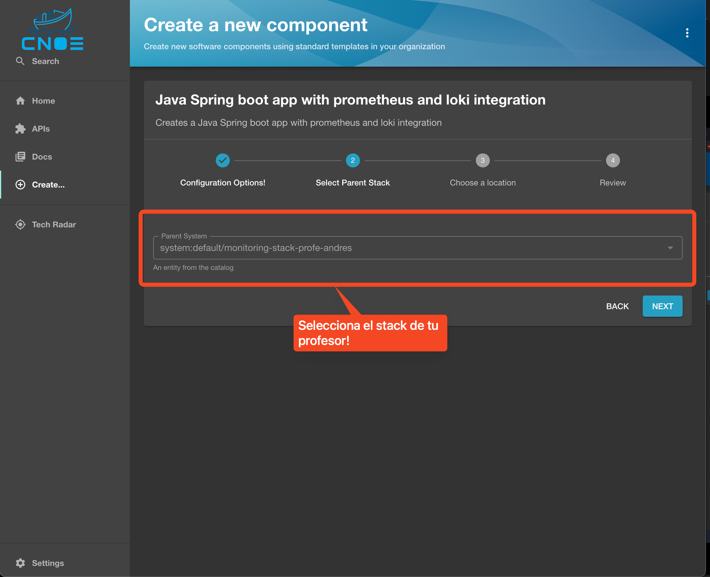

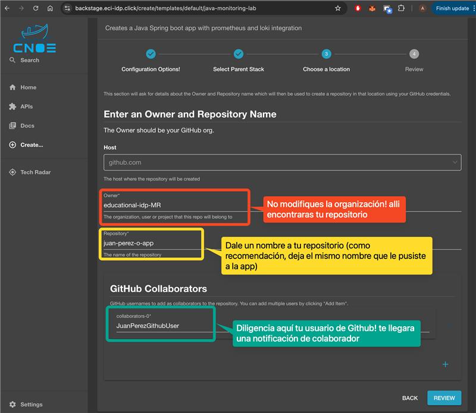

4. Revisa los destalles que diligenciaste y presiona el boton `create`
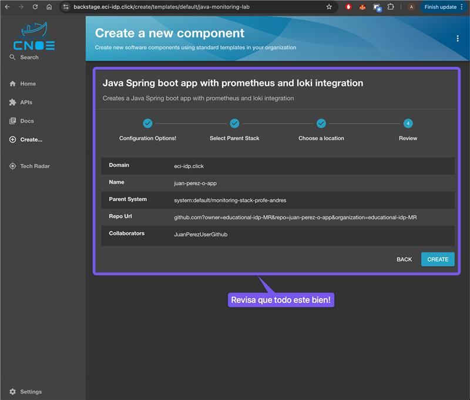

5. Al finalizar el proceso recibiras el enlace de github donde se ha creado la aplicación. Para poder escribir código sobre este repositorio, revisa las notificaciones de tu cuenta de github y aprueba la invitación a participar.

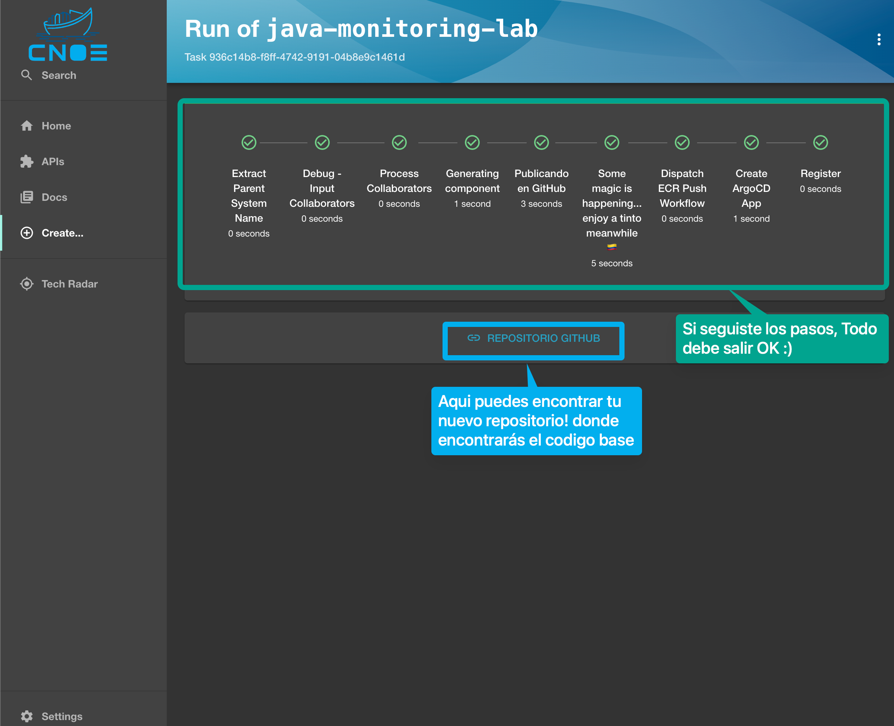

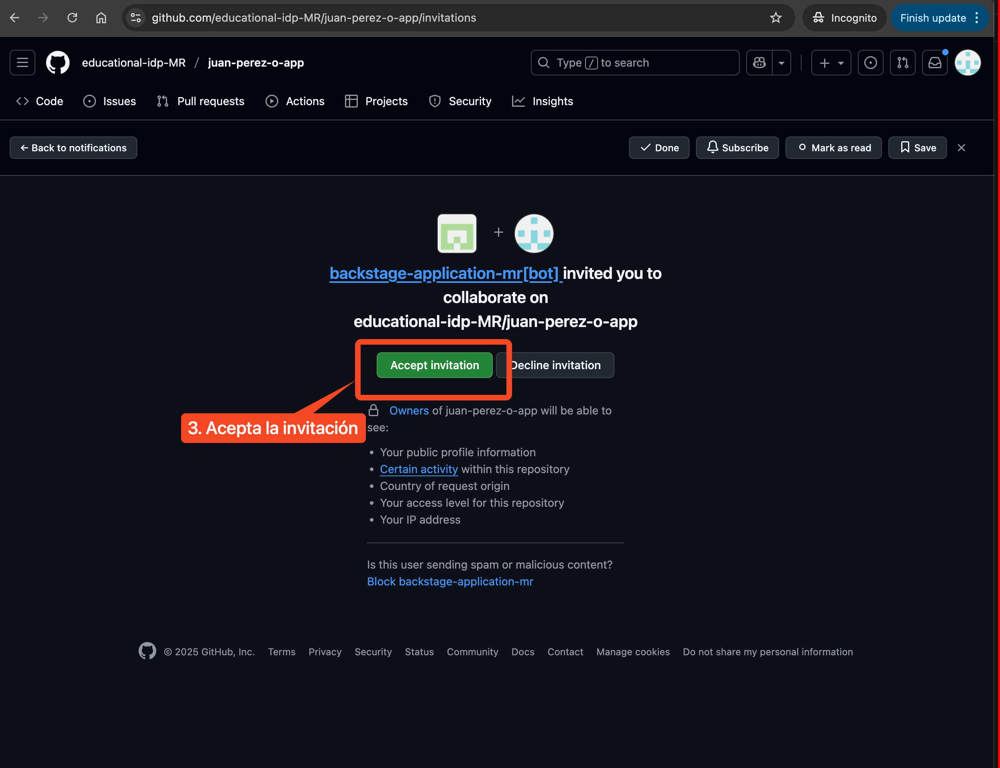

6. Una vez aceptes la invitación ya puedes clonar el repositorio y modificarlo según lo que el laboratorio te indica!

7. Mientras tanto, la aplicación se estará desplegando, podras encontrar el estado de la aplicación en `home` -> `nombre de tu aplicación`. En la sección de `ArgoCD overview` ->`Sync status / Health Status`, espera hasta que la aplicación aparezca en estado  `Synced` y `Healthy`, esto puede tomar entre 3 y 5 minutos. 

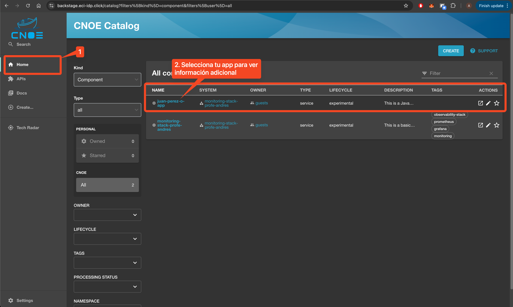

8. A continuación se explica la información que provee tu aplicación en backstage
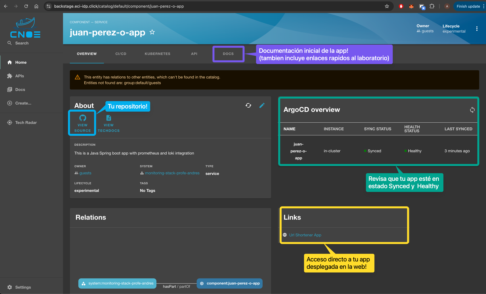

9. Accede a la url de tu aplicación para verificar el despliegue. Ten en cuenta que es una aplicación sencilla por lo que no cuenta con certificados HTTPS, por esto es necesario omitir las validaciones del navegador.

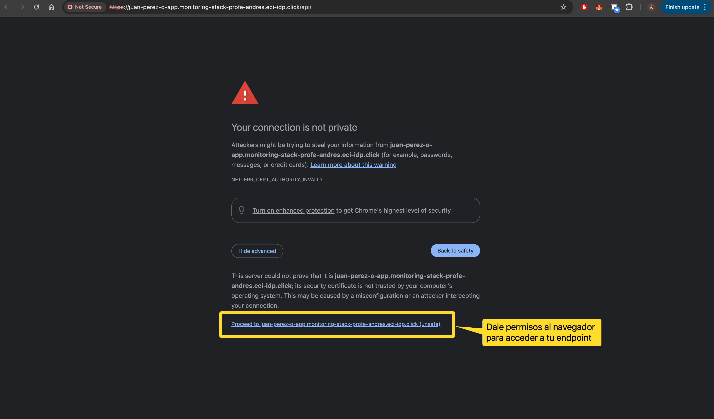

10. Al finalizar deberías encontrar algo como lo que se muestra en la siguiente imagen:
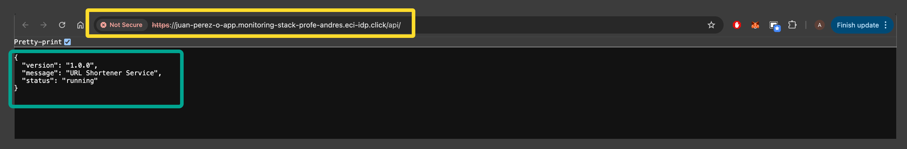

---

## ✅ Verificación del Ambiente

Si llegaste hasta aquí y puedes ver la aplicación corriendo en tu navegador, **¡felicidades!** Has completado exitosamente la preparación del ambiente.

> **💡 Consejo:** Guarda el DNS de tu aplicación, lo necesitarás durante todo el laboratorio.

**Registra en tu [bitácora](../Bitacora.md):**
- ✍️ DNS de aplicación
- 📸 Captura de pantalla de la aplicación funcionando
- 📝 Cualquier problema encontrado y cómo lo resolviste

---

## 📍 Próximos Pasos

Ahora que tu ambiente está configurado, es momento de explorar las métricas que expone la aplicación.

### ➡️ [Continuar a la Etapa 2: Métricas Iniciales](./2-metricas-iniciales.md)

---

  <button id="finish-stage-btn" class="finish-stage-btn" data-next-url="./2-metricas-iniciales">
    ✅ Finalizar Etapa y Continuar ➡️
  </button>
  

    💾 Al hacer clic, tu tiempo será guardado automáticamente y continuarás a la siguiente etapa
  

---

[🏠 Volver al Inicio](./main.md) | [➡️ Siguiente: Etapa 2](./2-metricas-iniciales.md)

