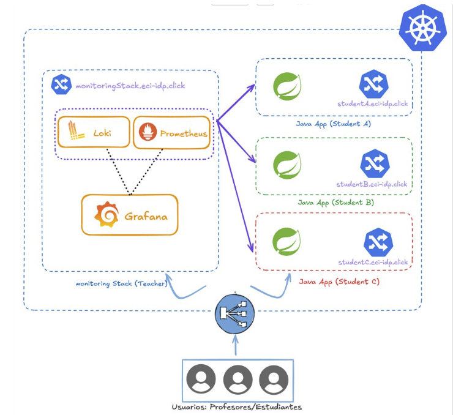

# 🔬 Taller de Telemetría y Observabilidad en Entornos DevOps

> **Bienvenido al laboratorio de observabilidad**  
> Este taller te guiará a través de la implementación práctica de métricas, logs y dashboards usando Prometheus, Grafana y Loki.

---

## ⏱️ Duración Estimada del Experimento

> **💡 Tip para medir tu tiempo:**  
> Puedes usar un cronómetro (en tu teléfono o [online](https://www.online-stopwatch.com/)) para trackear cuánto tiempo te toma completar el laboratorio. Esto te ayudará a planificar mejor tu sesión de estudio.

### 📋 Tiempo Estimado por Etapa

| Etapa | Descripción | Tiempo Estimado |
|-------|-------------|:---------------:|
| **Etapa 1** | Preparación del Ambiente | ⏱️ 20-30 min |
| **Etapa 2** | Métricas Iniciales | ⏱️ 15-20 min |
| **Etapa 2.1** | Dashboard Base en Grafana | ⏱️ 30-40 min |
| **Etapa 2.2** | Propuesta de Métrica Personalizada | ⏱️ 25-35 min |
| **Etapa 3** | Experimentación y Análisis | ⏱️ 30-40 min |
| | **TOTAL** | **⏱️ ~2-3 horas** |

---

## 🎯 Objetivos del Taller

Al finalizar este laboratorio, serás capaz de:

- ✅ **Desplegar** una aplicación instrumentada con telemetría en un entorno cloud
- ✅ **Analizar** métricas expuestas por aplicaciones usando Prometheus
- ✅ **Construir** dashboards interactivos en Grafana para visualizar el comportamiento del sistema
- ✅ **Implementar** métricas personalizadas basadas en el dominio de negocio
- ✅ **Detectar** anomalías y correlacionar eventos usando métricas y logs
- ✅ **Aplicar** el método científico para diagnosticar y corregir problemas

---

## 🏗️ Arquitectura Utilizada

Este laboratorio utiliza los siguientes componentes desplegados en un cluster de kubernetes:

Cada estudiante dispone de una aplicación Java, que ya está configurada para exponer métricas mediante el endpoint `actuator/prometheus`. Esta aplicación ya cuenta con las configuraciones necesarias para ser desplegada en Kubernetes. 

Adicionalmente, el profesor del laboratorio disponibiliza 3 componentes: 
1. Loki se encarga de la recolección y almacenamiento de logs de las aplicaciones de los estudiantes
2. Prometheus se encarga de la recolección y almacenamiento de métricas de las aplicaciones de los estudiantes
3. Grafana se integra con Loki y Prometheus para permitir la creación de visualizaciones a partir de los datos almacenados. 

Tanto Grafana como las aplicaciones de los estudiantes pueden accederse mediante un balanceador de carga que distribuye las peticiones a las aplicaciones correspondientes según el subdominio asignado.

**Stack Tecnológico:**
- 🚀 **Aplicación:** Java Spring Boot (URL Shortener)
- 📊 **Métricas:** Prometheus + Spring Boot Actuator
- 📝 **Logs:** Loki + Promtail
- 📈 **Visualización:** Grafana
- ☁️ **Infraestructura:** Kubernetes (AWS EKS) + ArgoCD + Github Actions

---

## 📚 Estructura del Laboratorio

El taller está organizado en etapas progresivas:

### 🚀 [Etapa 1: Preparación del Ambiente](./1-preparacion_ambiente-idp.md)
**Duración:** ~20-30 minutos

Configuración del entorno de trabajo:
- Aprovisionamiento de instancia EC2 en AWS
- Instalación de Docker y Docker Compose
- Despliegue de la aplicación y stack de observabilidad
- Verificación del ambiente

➡️ **[Comenzar Etapa 1](./1-preparacion_ambiente-idp.md)**

---

### 📊 [Etapa 2: Métricas Iniciales](./2-metricas-iniciales.md)
**Duración:** ~15-20 minutos

Exploración de métricas expuestas:
- Generación de tráfico hacia la aplicación
- Análisis del endpoint `/actuator/prometheus`
- Identificación de métricas relevantes (counters, gauges, histogramas)
- Comprensión de labels y tipos de métricas

➡️ **[Ir a Etapa 2](./2-metricas-iniciales.md)**

---

### 📈 [Etapa 2.1: Dashboard Base en Grafana](./3-grafana-dashboard-base.md)
**Duración:** ~30-40 minutos

Creación de visualizaciones:
- Configuración de datasources (Prometheus y Loki)
- Construcción de paneles para solicitudes, latencia y errores
- Implementación de filtros con variables
- Visualización de logs con LogQL
- Extensión del dashboard con paneles personalizados

➡️ **[Ir a Etapa 2.1](./3-grafana-dashboard-base.md)**

---

### 🔧 [Etapa 2.2: Propuesta de Métrica Personalizada](./4-propuesta-metrica.md)
**Duración:** ~25-35 minutos

Instrumentación personalizada:
- Análisis del comportamiento del sistema
- Diseño de métrica de dominio
- Implementación en código Java
- Validación en Prometheus
- Visualización en Grafana

➡️ **[Ir a Etapa 2.2](./4-propuesta-metrica.md)**

---

### 🔍 [Etapa 3: Experimentación y Análisis](./5-analisis-dashboard.md)
**Duración:** ~30-40 minutos

Análisis y mejora continua:
- Detección de anomalías y patrones
- Correlación de métricas y logs
- Identificación de problemas de rendimiento
- Modificación de código para corregir anomalías
- Validación de mejoras con métricas

➡️ **[Ir a Etapa 3](./5-analisis-dashboard.md)**

---

## 📝 Bitácora del Laboratorio

A lo largo del taller, documentarás tu trabajo en la [**Bitácora del Laboratorio**](../Bitacora.md). Este documento contiene:

- ✍️ Espacios para registrar observaciones
- 📸 Secciones para capturas de pantalla
- 🤔 Preguntas de reflexión
- 📊 Análisis de métricas y visualizaciones

> **💡 Importante:** Completa cada sección de la bitácora a medida que avanzas en el taller. Esto te ayudará a consolidar el aprendizaje y servirá como evidencia de tu trabajo.

---

## 🚀 Cómo Comenzar

1. **Descarga la bitácora:** Abre el archivo [`Bitacora.md`](../Bitacora.md) y tenlo disponible para ir completándolo
2. **Sigue el orden:** Completa las etapas en secuencia (no saltes pasos)
3. **Documenta todo:** Toma capturas de pantalla y registra tus observaciones
4. **Experimenta:** No tengas miedo de explorar más allá de las instrucciones

**¿Listo para comenzar?** 👇

### ➡️ [**Comenzar con la Etapa 1: Preparación del Ambiente**](./1-preparacion_ambiente-idp.md)

---

## 📖 Recursos Adicionales

- 📚 [Documentación de Prometheus](https://prometheus.io/docs/)
- 📚 [Documentación de Grafana](https://grafana.com/docs/)
- 📚 [PromQL Cheat Sheet](https://promlabs.com/promql-cheat-sheet/)
- 📚 [LogQL Guide](https://grafana.com/docs/loki/latest/logql/)
- 📚 [Spring Boot Actuator Metrics](https://docs.spring.io/spring-boot/docs/current/reference/html/actuator.html#actuator.metrics)

---

## ℹ️ Información del Taller

**Contexto:** Este taller forma parte del curso de DevOps y tiene como objetivo proporcionar experiencia práctica en observabilidad de sistemas, una habilidad fundamental en la ingeniería de software moderna.

**Requisitos previos:**
- Conocimientos básicos de línea de comandos
- Familiaridad con conceptos de HTTP/REST APIs
- Acceso a AWS (credenciales proporcionadas)

---

**¡Buena suerte y disfruta el laboratorio! 🎉**

